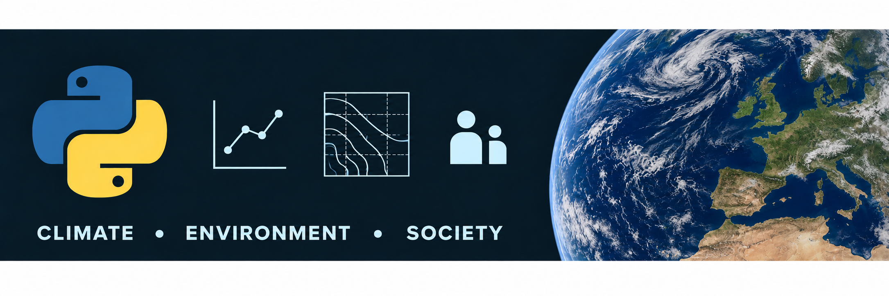

# Python for Geographical Data Analysis

Practical Python learning resources for geographical data analysis at Maynooth University.

This repository supports:

- **GY674: Earth Science Data Analysis in Python**
- **GY675: Visualising Inequality**

The materials may also be useful to postgraduate researchers and staff who are beginning to use Python for data analysis.

## Start here

- [Python Quick Reference Guide](quick-reference/README.md)
- [Recommended textbooks and further resources](quick-reference/README.md#12-learning-resources-and-documentation)
- Learning notebooks — coming soon
- Worked examples — coming soon

## Using the notebooks

The notebooks are designed to run in Google Colab. Links to available notebooks and instructions for creating your own editable copy will be added here.
